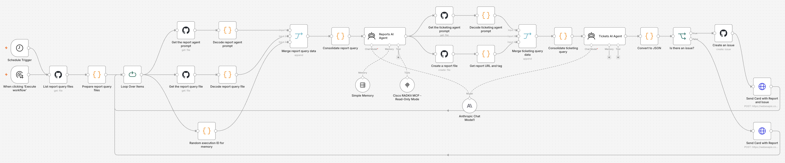
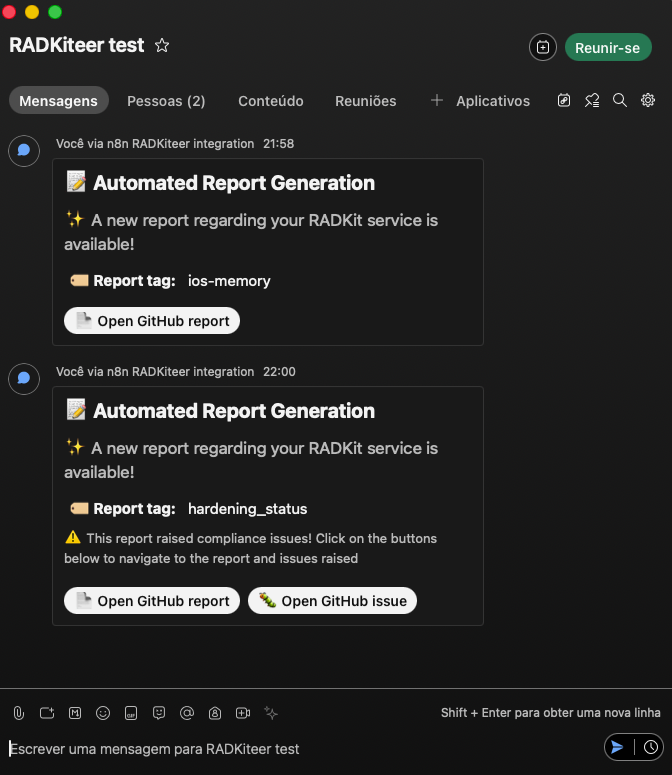
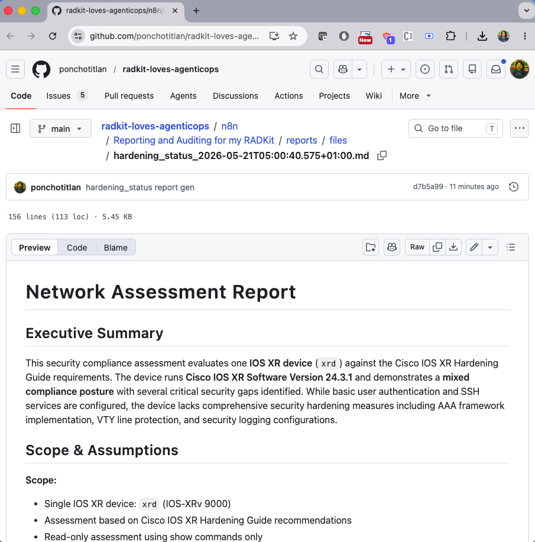
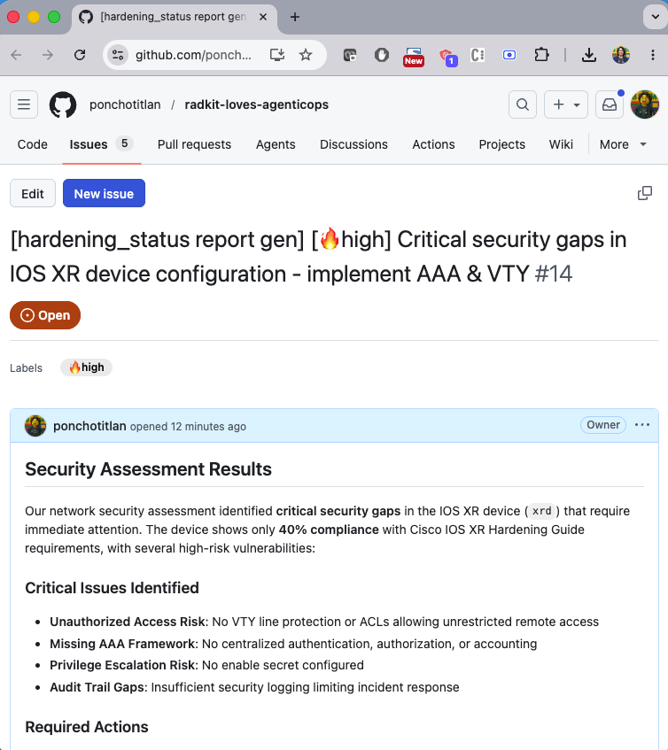

# 📊 Agentic Reporting & Automated Ticketing for my RADKit Workflow (n8n + GitHub)

An **agentic n8n workflow** that automatically:

- 🧠 Investigates network state
- 📝 Generates professional technical reports
- 📁 Commits reports to GitHub
- 🎫 Detects issues and auto-creates GitHub tickets with actionable tasks

Designed for **continuous operational visibility** and **reporting + issue creation**.

---

## ✨ What this gives you

- 📅 Scheduled or manual report generation  
- 🤖 Agent-driven investigation using real device data  
- 📄 Structured Markdown reports (committed to GitHub)  
- 🎫 Automatic issue creation when risks/recommendations are detected  
- 🔗 Tight traceability between reports and tickets  
- 🧩 Fully auditable, GitOps-friendly workflow  

---

## 🧠 Architecture at a glance

| Agent | Responsibility | Talks to Network? | Creates Tickets? |
|------|----------------|--------------------|------------------|
| Reporting Agent | Investigates, gathers facts, renders Markdown report | ✅ via Cisco RADKit MCP (`Cisco RADKit MCP - Full Mode`) | ❌ |
| Ticketing Agent | Analyzes report, detects issues, generates GitHub issue | ❌ | ✅ |

Clean separation of concerns:  
> One agent observes. One agent escalates.

---

## 🔄 End-to-end flow

1. Workflow triggered:
   - ⏱️ By scheduler  
   - ▶️ Or manually  

2. System loads dynamically from GitHub (current repo):
   - All report query files under `n8n/Reporting and Auditing for my RADKit/reports/*.txt`
   - Reporting agent prompt: `n8n/Reporting and Auditing for my RADKit/agents/network_report_agent.txt`
   - Ticketing agent prompt: `n8n/Reporting and Auditing for my RADKit/agents/network_ticketing_agent.txt`
   - Queries are processed one-by-one via `Loop Over Items`

3. **Reporting Agent**:
   - Uses **Cisco RADKit MCP** (`http://host.docker.internal:8083/mcp`) to query devices
   - Runs with Claude Sonnet model + session memory key per execution
   - Produces a structured Markdown report with sections like:
     - Executive Summary  
     - Analysis & Findings  
     - Risks & Considerations  
     - Recommendations  

4. Report is automatically committed to GitHub:
   - 📁 Target folder: `n8n/Reporting and Auditing for my RADKit/reports/files/`
   - Naming pattern: `<file_prefix>_<timestamp>.md`

5. **Ticketing Agent**:
   - Loads its prompt from GitHub  
   - Analyzes the generated report  
   - Converts agent output to JSON and checks `create_issue`
   - If `create_issue = true`:
     - 🎫 Creates a GitHub issue including:
       - Priority  
       - Summary  
       - Detailed description  
       - Actionable task list  
       - Link to the originating report
   - If `create_issue = false`, no issue is created

6. Notification step (Webex):
   - Sends an adaptive card with report link in all cases
   - Includes issue link when an issue is created

 
 
 
 

---

## 📂 GitHub-driven behavior

This workflow is intentionally **Git-native**:

- All agent prompts are stored in GitHub  
- Report requests are stored in GitHub  
- Outputs (reports) are committed to GitHub  
- Findings become GitHub Issues  

This enables:
- Versioned prompts  
- Reviewable report definitions  
- Full audit trail  
- Native integration with engineering workflows  

---

## 🏗️ Use cases

- Continuous network posture reporting  
- Audit preparation  
- Compliance evidence generation  
- Proactive risk detection  
- Auto-generated remediation backlogs  
- GitOps-driven NetOps workflows  

---

## 🛠️ Setup

### 1. Run n8n and the Cisco RADKit MCP server using Docker-Compose

Check [this guide](../../docs/HOWTO-RADKIT-MCP.md#-running-n8n-without-cloudflare) for using the included docker-compose file for this purpose.

### 2. n8n workflow import
1. Navigate to your n8n instance on a web browser
2. Create a new workflow
3. Import the file [WxT ChatOps for my RADKit.json](WxT%20ChatOps%20for%20my%20RADKit.json) included in this repository

---

 
    Made with ☕️ by Poncho Sandoval - <code>Developer Advocate 🥑 @ DevNet - Cisco Systems 🇵🇹</code>

